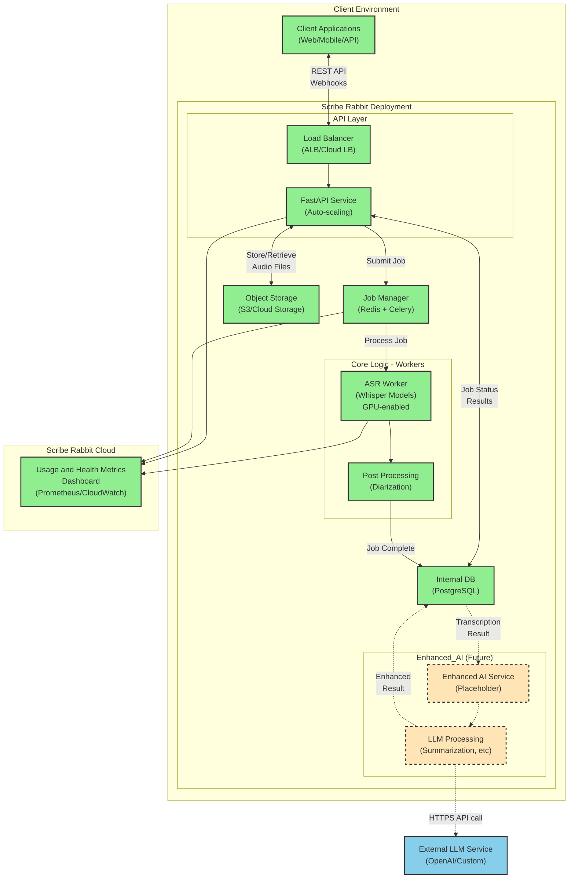
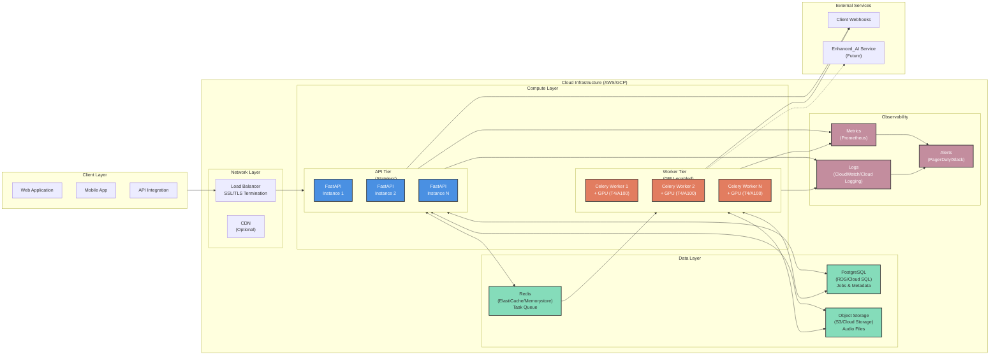
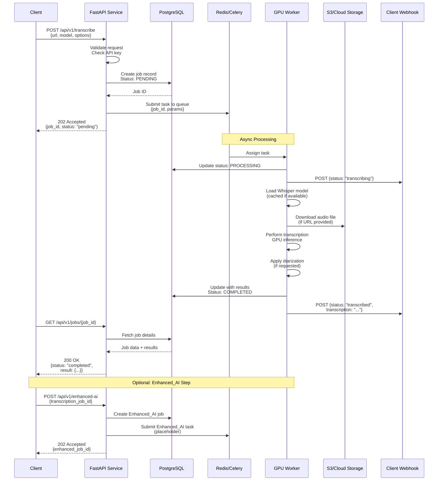
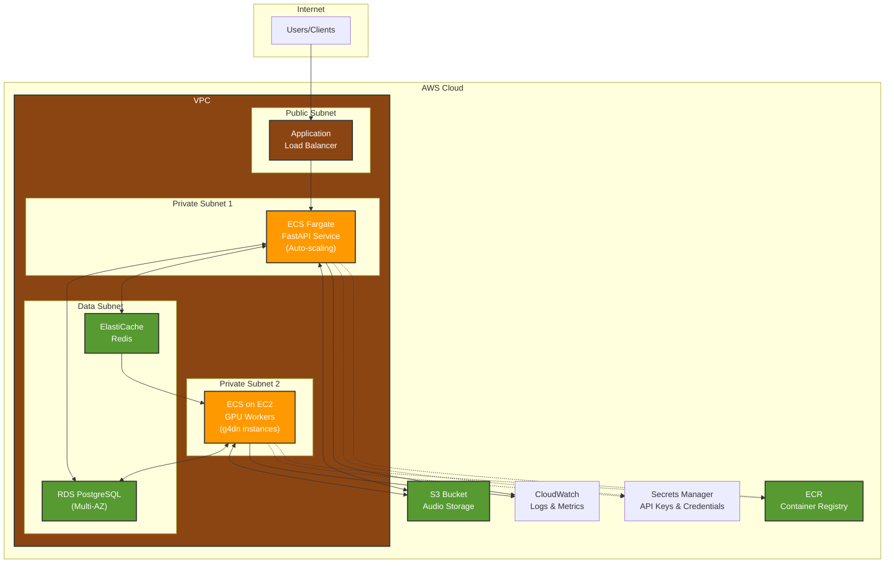
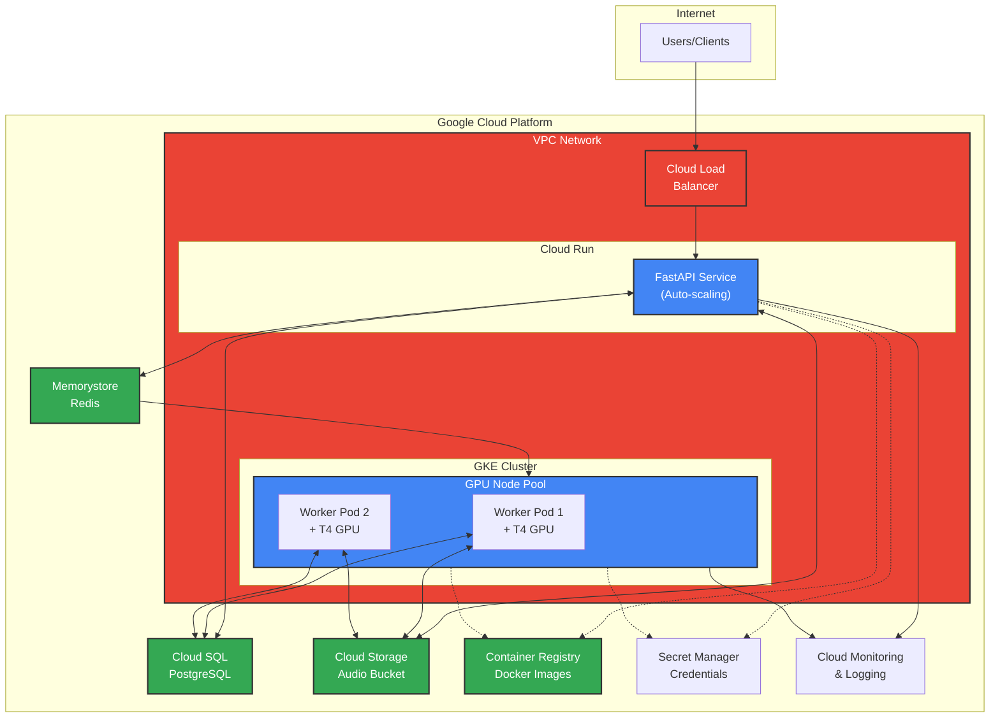
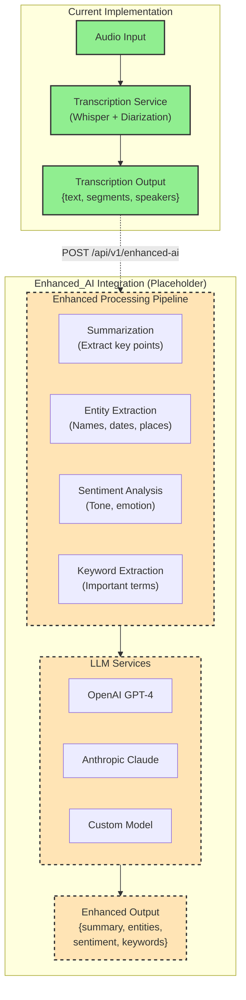

# Scribe Rabbit Architecture Diagrams

## Overview Architecture

This document contains architecture diagrams for the Scribe Rabbit transcription service.

## Current Implementation - FastAPI Deployment

**Legend:**
- 🟢 Green boxes: Fully implemented
- 🟡 Orange dashed boxes: Placeholder for future Enhanced_AI integration
- 🔵 Blue boxes: External services

---

## Detailed Component Architecture

---

## Job Processing Flow

---

## AWS Deployment Architecture

---

## GCP Deployment Architecture

---

## Enhanced_AI Integration (Future State)

---

## Notes

1. **Green solid boxes** indicate fully implemented components
2. **Orange dashed boxes** indicate placeholder components for Enhanced_AI integration
3. **Blue boxes** indicate external services
4. All diagrams reflect the current FastAPI-based architecture suitable for AWS or GCP deployment
5. The Enhanced_AI integration is designed but not yet implemented, providing a clear path for future development

## Quick Reference

- **API Documentation**: Available at `/docs` when service is running
- **Health Check**: `GET /health`
- **Metrics**: `GET /metrics` (Prometheus format)
- **Job Status**: `GET /api/v1/jobs/{job_id}`
